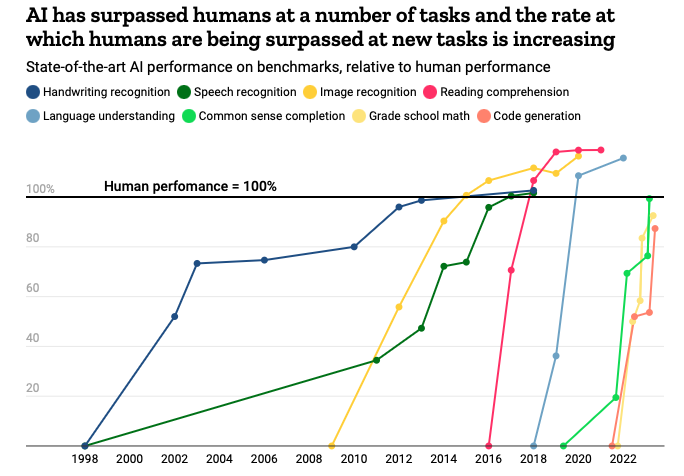

# 4. Guiding Policy (Our Approach)

<figure><figcaption></figcaption></figure>

### **Guiding Policy 1:** **Always be use-case and people lead (Solving real, unique & diverse problems of Bharat of today)**

* **Use-case led approach can make us focus our efforts and attention.** Picking winning use cases for India's problem can lead to companies building for India, and attracting foreign capital to india.
* India should be building models that are specialised and solve real problems. This is not separate from the goal of becoming a world leader in AI or AGI, this is our path to prove that India can do it.
* Currently very large models are like aeroplanes that are landing on top of air strips. We need to find a way to take these to every nook and corner of the country - the IT tech corridors, the busy city roads, the village kachcha roads, etc. Here we discuss the need for supporting diverse languages and cultures, quintessentially Indian interests, and a melange of value systems.&#x20;
* **Corollary: We need to have in our action plan a feedback loop of generating insights** on Indian problems solvable with AI and share them openly.
* **AI for us should not become a hammer looking for a nail.** Another corollary is that we need to focus on the problems and use-cases to solve, and then evaluate if AI makes sense there.&#x20;
* **We wanted to think in first principles** on what problems does India face, what does it need and then only work backwards from from these cases to what AI can solve. Not every problem might need AI of course. But we will have recognised the policy and other changes required and share those learnings openly as well.

### **Guiding Policy 2 - Emphasise the Ecosystem Jugalbandi (Create open ecosystem enablers, the Bharat way)**&#x20;

* **The DPI approach,** moved the layer of competition from siloed gardens to broad reach. We need to extend it further for AI. Its part of a larger drive to digitize what we're doing, before we can consume it for AI
* **We have to bring together** the public, private enterprises and research institutions to build systems out of jugal-bandi.&#x20;
* &#x20;**Create open ecosystem enablers, the Bharat way.**
  * India's approach of creating Digital Public Infrastructure with a public railroad with private innovation has unlocked enormous productivity. With AI, there is an additional emphasis on the educational institutions&#x20;
  * This even has implications on re-thinking privacy. We do nothing at the cost of privacy (which is a fundamental right for Indians). Privacy is going to be rethought in the age of ai. You want something to be personalised, but you don't want adverse effects. So what does that mean? Can a model use your data or not?

### **Guiding Policy 3 - Ensure Trust & a Responsible Future.**&#x20;

1. **Guide Preservation of culture.** Its part of a larger drive to digitize what we're doing, before we can consume it for AI. Guide actions by Bharat culture informed Ethics.&#x20;
2. **Ensure responsible creation, deployment and evaluation of AI systems along with promoting a right policy to regulate while incorporating public opinion on AI ethics & deployment.**  Craft the right policy that is suitable for the unique needs of India.&#x20;
3. **Ensure sustainable absorption of economic shocks and a thriving biosphere for the ecosystem.** Eg: We leverage our youthful population and create flywheel systems for employment generation and grow the ecosystem at large, resisting a default power law.\
   \

**Other angles to write this :**&#x20;

1. Can talk in terms of an easy-to-understand framework like the golden triangle of AI
