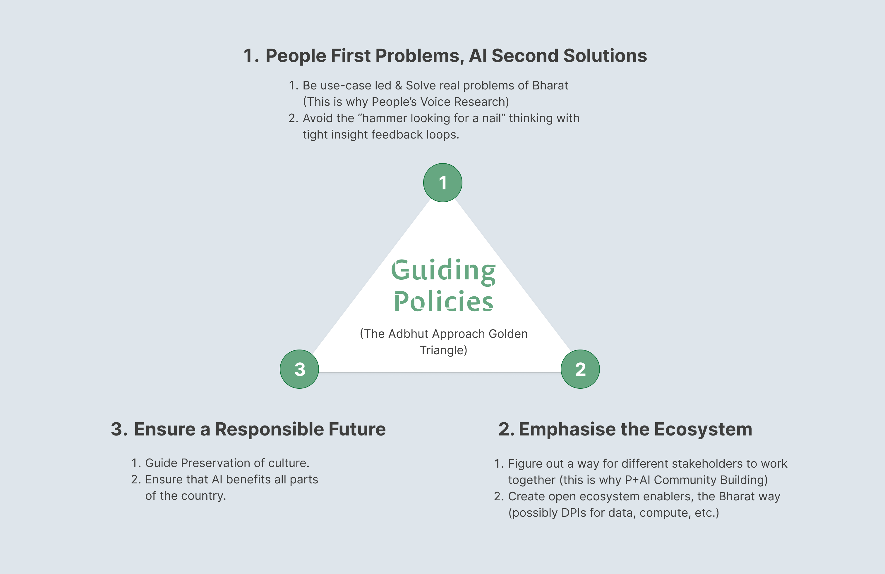

# 5. Key Actions (Main Strategy)

We need to take coherent actions to enable the ecosystem to thrive and answer “how do we achieve x” by keeping in mind our guiding policy and **principles.**

<figure><figcaption>
The Ecosystem Layers relevant for the Strategy
</figcaption></figure>

## 6.1. Applications - Identify & Propagate India's Unique use-cases&#x20;

**Objective** - Share details on successful use-cases widely and openly, to further innovation, replication, or scaling up. Before we get started on building, knowing what use cases can thrive in India/ examples of functioning models from India will be helpful in focussing limited resources for maximum leverage. Success here will bring in more resources to the problem.

### **What do we do here?**

1. **Next 3 months focus:** Conduct deep research to identify problems of Bharat across sectors.
   1. **Identify key sectors and the transformations** that will take hold in each one. Some  key Paradigm Shifts PeoplePlusAI is looking to explore: Voice First, Bottom-up Governance with Conversations at Scale, +ai talent (more in Section 6.5)
   2. **Identify how we can best encourage AI adoption** in sectors where technology is not the core business (like agriculture, healthcare, etc.)
2. **Next 6 months focus:**&#x20;
   1. **Pilot hero use-cases.** Establish collaborations with academic institutions and industry bodies to jointly work on pilot projects, deriving insights on AI adoption barriers in non-tech sectors like agriculture and healthcare.
   2. **Share People's Voice Series** as part of PeoplePlusAI deep research on workflows of business owners and workers beyond tier-2 cities.
3. **Next 2 years focus:** \[TBD]

## 6.2. Models - Encourage Model Innovations with Deep Research

**Objective** - Propagate creation and deployment of sustainable AI models that align to Indian culture, context, & languages.

## **What do we do here?**

**Next 3 months focus:**&#x20;

* **Create Bharat Benchmarks**.  Create benchmarks to evaluate language and other models on accounts of the culture and context of India in terms of comprehension and accuracy.&#x20;

**Next 6 months focus:**&#x20;

* **Drive partnerships** between research + govt and companies to create models optimised for India across RLHF.
* **Building India-focused LLMs from** scratch with Indic data is a longer-term strategy as it is more expensive. We should first see if adaptation of another LLAMA-like model does the job for us. We don't know if a model from scratch will necessarily be any better. Regardless the benchmark and data layers need to be in place.

**Next 12 months focus:**&#x20;

* **Focused R\&D**: Allocate resources specifically for the development of efficient and domain-specific AI models. Focus on building these models, distillation, and fine-tuning. Eg: Advocate for sustainable 3B-20B range models in case of LLMs and make possible their availability to ecosystem teams that required them. \

## 6.3.  Putting in place a Comprehensive Data Strategy (Data Do, X Lo)

**Objective** - Enable AI for all Indians by **unlocking data** for AI from various sources for training while ensuring data privacy. Prioritize collecting data in multiple Indian languages to ensure inclusivity. Given India's linguistic diversity, it's essential to collect, curate or even create datasets (wherever necessary) in multiple Indian languages.&#x20;

### **What do we do from here?**

**Next 3 months focus:**

1. **Evaluate amount of Indic Language data needed (Audit)** such that we can work backwards to have a comprehensive strategy to unlock it. Eg: A goal of 10 billion tokens per language required for improved accuracy on par with English for language and speech models would require a different strategy than if we wanted 100 billion tokens per language.&#x20;
2. **Evaluate Requirements of a Data Sharing & Reciprocation Strategy (DSRS):** Create platforms that facilitate the exchange of data across sectors, enabling multi-disciplinary collaborations and innovations. Such platform needs can incorporate a reciprocation strategy for the ecosystem such as **"Data do, Compute Lo"** or "Data do, Model Lo", wherein a company sharing the data for a model to be trained can be given compute or a trained model usage credits in return. All this can be done while ensuring privacy guarantees along with ecosystem.
3. **Create, Curate, Collect & Correct Data For.**&#x20;
   1. **Benchmarks**. Create a diverse set of multilingual prompts in Indian context by giving specific meta-prompts across multiple domains (“Eg: Imagine you are interacting with a bot on govt policies, what are the kind of questions you will ask”, “Imagine you are interacting with a NCERT bot, what are some tasks you would like it’s help with”) Evaluate the responses from proprietary and open LLMs.

**Next 6 months focus:**&#x20;

* **Data Corpus Initiatives for Indic Languages and Indian context.** Work with various sectors (healthcare, transportation, agriculture) and the Government to compile extensive and diverse datasets, keeping in mind our guiding policies that are ethically sourced. **It's crucial to figure out how Government and Private partnerships work with data.** This data can be used for fine-tuning, etc. &#x20;
  * **Government Datasets of Indic Languages:** Promote open data initiatives where anonymised and non-sensitive data is made publicly available for research and development purposes. Identify digitisation strategies for data that is not available digitally.
  * **Private Datasets:**  Work with various sectors (healthcare, transportation, agriculture) to compile extensive and diverse datasets, keeping in mind our guiding policy of ensuring a Responsible Future by being ethically sourced through value creation..
* **Build a platform for data creation:** create, curate, correct. Multiple workflows: crowdsource, sponsored data hackathons, in-house (say, by AI4Bharat’s annotation team), course projects through AI4Bharat.&#x20;

**Next 12 months focus:**&#x20;

1.  **Create and execute a pilot with the Data Sharing & Reciprocation Strategy (DSRS)** in order to test the use-case.

2. **Elaborate possible Data Copyright & Pricing Policies.** While Japan has a copyright-free approach to all data, EU regulations are far more stringent. We aim to evaluate the approach India ought to take, giving due consideration to social, economic, government, legal and private stakeholder concerns. The end-goal would be to have a clear idea on how to price data and to lay down compensation structures for models using different kinds of data.

## 6.4. Compute Infrastructure

**Objective** - The objective of the Compute Infrastructure is to streamline the deployment of computational resources, ensure a substantial Return on Investment (ROI) through efficient utilisation, and strategically plan for the evolving computational needs to foster a conducive environment for innovation and growth in academia, industry, and government sectors.

###

### **What do we do about Compute?**

**Next 3 months focus**:

* **Compute Requirement Assessment:** Conduct a thorough assessment to ascertain the compute requirements of academia and industry.Establish a task force comprising representatives from academia, industry, and government to continuously update these estimates based on emerging needs and technological advancements.

**Next 6 months focus:**&#x20;

* **Cloud Partnerships**: Partner with cloud providers to facilitate computational needs at discounted rates for AI research.
* **Compute Pooling**: Evaluate and design a compute pooling framework where Indian organisations and the Government can contribute their computational resources, enabling a compute credits system to efficiently allocate and utilize the pooled power.

**Next 12 months focus:**

* **Evaluate & Pilot compute credit sharing schemes.**&#x20;
  * Compute bonds, also termed as "pre-purchased credits," are conceptual digital tokens equating to a specific amount of computational power, be it in cloud or localized infrastructures. Their intrinsic value is derived from the computational resources they signify, such as CPU cycles, GPU hours, or storage capacities. These tokens can be traded, exchanged, or directly utilised for computing tasks, offering a versatile medium for startups to access essential computational capabilities without incurring the direct costs of the hardware.
  * Investors such as Venture Capitalists (VCs) can capitalise on this model by investing in these compute bonds, essentially pre-purchasing computational resources like GPUs. These are subsequently pooled together, forming a computational reservoir. Startups, upon receiving these credits from VCs, have the flexibility to redeem them with any provider, ensuring they have the best technology at their disposal. This model shifts the risk of technological obsolescence to the market, allowing startups to focus solely on innovation, while also ensuring that resources are optimally allocated to those who need them the most.
* **Enhance the "pooled compute" reservoir with Production-Linked Incentive (PLI) based schemes.**&#x20;
  *   By aligning PLIs with compute credits, the government or incentivizing bodies could provide a twofold boost: immediate access to essential resources and subsequent rewards for scaling production.

      \

## 6.5. Creating a "plus-AI" Talent Pool that’s able to “surf” through Job Displacement&#x20;

**Objective -** Establish a robust job re-skilling network and platform for "+ai talent," focusing on eliminating language barriers and refining skilling experiences. As AI's adoption grows, it's crucial to nurture individuals who harness AI's potential, ensuring that they don't get replaced but rather adapt to the evolving job landscape. The aim is to blur job boundaries beneficially, make AI proficiency easily achievable, and integrate skilling with certification and job opportunities seamlessly. It's success hinges on ensuring that it is affordable and accessible across the country.

Note: Talent is divided broadly into creator and consumer ecosystems of talent. Eg: AI Engineers that create models in a research organisation are creators and a farmer using it to understand Government schemes is a consumer.&#x20;

**Next 3 months focus**:

* **AI Course Development & Talent Fostering (Creator):** Starting from the "innovators" of the funnel. Introduce state-of-the-art courses that not only teach AI but also inspire innovation. Encourage learners to undertake AI projects, offering mentorship and resources.&#x20;

**Next 6 months focus**:

* **Champion AI projects for re-skilling (Consumer):** Pilot applications of AI in re-skilling workers within 2-3 sectors and share learnings on the impact with the larger ecosystem and inform the strategy to up-skill workers via.

**Next 12 months focus**:

* **Make AI more accessible to use for the public (Consumer).** This includes making models that work for Tier 3 cities and beyond. Eg: Models that work for speakers of other languages such as Hindi, Telugu, etc.
* **Re-skilling Platforms:** Develop online platforms specifically geared towards re-skilling the existing workforce in AI-related capabilities.&#x20;
* **Create opportunities** for talent absorption post skilling. Create a dedicated  platform to connect skilled individuals to job opportunities.&#x20;

<table data-full-width="true"><thead><tr><th width="163.33333333333331">Industry/Segment</th><th width="140">Number &#x26; Percent</th><th>Impact</th></tr></thead><tbody><tr><td>Agriculture &#x26; Allied Workers</td><td>200 million+</td><td><ul><li>Contribute to formalisation of the sector. </li><li>Impart scientific information and training  to stakeholders at the grassroot level, in their native languages. </li><li>Improve efficiency and productivity within the sector.</li><li>Pave the way for largescale adoption of sustainable agricultural practices, keeping in mind ecological concerns. This would directly help in tackling climate change at the grassroot level. </li><li>Successful skilling programs would help move the workforce to other lucrative sectors, leading to improved standard of living. </li></ul></td></tr><tr><td>Blue Collar &#x26; Gig Workers</td><td>(500 million+) </td><td><ul><li>Ensure greater workplace safety and prevent exploitation. </li><li>Skilling programs in native languages will help workers access better opportunities </li><li>Ensure enrolment and access to government schemes, identity documents and social security schemes</li></ul>

</td></tr><tr><td>Builders (Start-ups)</td><td>[TBA]</td><td><ul><li>Help improve cost efficiency and expand the scale of the venture. </li><li>Easier access to skilled talent pool. </li><li>Easier access to compute and capital. </li></ul></td></tr><tr><td>Legal Professionals </td><td>(<em>1.5 million+</em>)</td><td><ul><li>Access to better legal and case research tools</li><li>Digitisation of the court system would further aid  lawyers and boost transparency of the system. </li><li>Availability of case laws in native languages bridges gaps in legal education, training and practice. </li><li>Expand access to cost effective legal aid.</li><li>The judicial system will become efficient and impactful. </li></ul></td></tr><tr><td>Educators </td><td>(<em>95 lakh+)</em></td><td><ul><li>Access to training and upskilling tools </li><li>Introduction of teaching  assistants to impart quality education </li><li>Accessible education including access to neurodivergent educational learning tools. </li><li>Methods of monitoring and tailoring learning pathways. </li></ul></td></tr><tr><td>Medical professionals </td><td>[TBA]</td><td>[TBA]</td></tr><tr><td></td><td></td><td></td></tr></tbody></table>

**Open Questions :**&#x20;

1. **How would we approach re-skilling for 500 million adults?** Which industries should we focus on first (1-2 years) and then which in the next 5-7 years? How do we gauge and incorporate public opinion on AI ethics and deployment?&#x20;
2. What kind of courses should happen at university level and school level and workforce industry professionals level?

\

**Other angles to write this :**&#x20;

Write from 3 Levels:&#x20;

1. Level 1: Talent pool that creates & deploys AI (Researchers etc.)
2. Level 2: that actively uses AI&#x20;
3. Level 3: General India - One knows how to use AI.&#x20;

\

## 6.6. Creating an Ecosystem Ensuring a Responsible Future (with Ethics, Safety, Guardrails)

**Objective -** Create a thriving India AI ecosystem community for knowledge sharing.

**Next 3 months focus**:

* **Emphasise building expertise at foundational level** on theory and practice. Startups and other industries which have a deep need to build and deploy these technologies in their tech stacks now. How do they go about doing it? They also need to be upskilled - perhaps more on the applied side, and they need it now. We need a course for them. This can be done by organising community events.&#x20;
* **Ethics, Safety & Legal Research.** Work with the larger ecosystem to Research AI ethics and safety with Indian Legal Institutes to debate, discuss and share what India's position should be with respect to copy-right for AI generated content as well as litigation and liability causes.
* **Draft guidelines for Responsible Future.** Responsible Future here means Responsible AI as well as a sustainable AI. Work with the larger ecosystem of startups, non-profits, "Big Tech" enterprises, etc. to draft the guidelines on "Responsible and Sustainable AI" to be shared and used by the the ecosystem and as a guide for policy makers.

**Next 6 months focus**:

* **Clear Guidelines:** Draft clear guidelines on data ownership, sharing, and usage to prevent misuse and ensure transparency in data handling.
* **Policy & Regulation.** Engage with legal experts and academia to examine the legal and ethical landscape surrounding AI, crafting preliminary frameworks that prioritize privacy and data sovereignty. Collaborate with the Government to shape policy for transparent, inclusive AI.  Possibly setup a new regulating agency that optimises for a thriving ecosystem within guardrails.

**Next 12 months focus**:

**Open Questions :**&#x20;

1. Legal Framework: Discuss the legal implications and requirements surrounding AI, such as privacy laws and data sovereignty
2. Ownership & IP Rights: Who owns the data? How do we negotiate the complex terrain of IP rights when data crosses borders?  &#x20;
3. &#x20;What will the regulating body be? Do we need an SRO for regulation in India?
4. At a policy and safety net level
5. Add long tail scenario of if we have AGI by 2030 what can be done, even at a policy and safety net level\
   \
   \
   \
